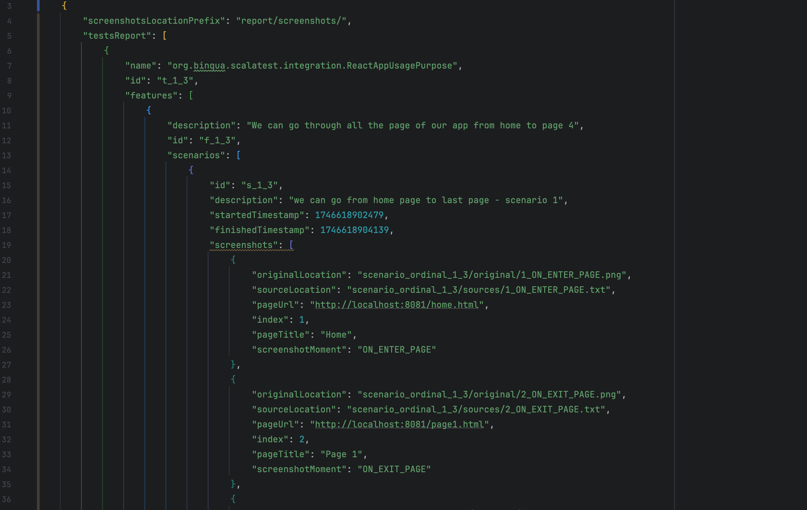
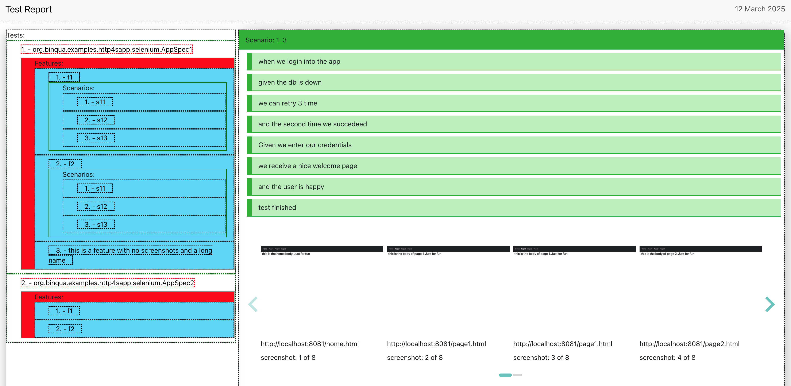

## Table of Contents

- [Project Overview](#project-overview)
- [Features](#features)
- [Installation](#installation)

## Project Overview

The goal of this project is to build a custom [Scalatest](https://www.scalatest.org) [Reporter](https://www.scalatest.org/scaladoc/3.0.5/org/scalatest/Reporter.html)

that captures all screenshots taken during automated tests of a web application.
To enable this, the reporter should be used alongside [FeatureSpecs](https://www.scalatest.org/user_guide/selecting_a_style) powered by [WebBrowser](https://www.scalatest.org/scaladoc/plus-selenium-2.45/3.1.1.0/org/scalatestplus/selenium/WebBrowser.html).
This setup allows the final test report to serve not just as a validation artifact, but also as living documentation of the entire application.

Now, imagine extending this concept further: in addition to screenshots, the reporter could also collect the HTML source code of each page rendered during testing. By indexing this source code, users could search and explore the test reports to discover where specific concepts (e.g., feature X, component Y, or behavior Z) appear throughout the app. This would make the test report an invaluable knowledge base for all stakeholders — including business analysts, testers, developers, and even new team members.

You wouldn’t need deep familiarity with the app — the test report itself would explain how the application behaves, assuming tests are written to cover key functionality as they should be.

Below there is an example of part of json generated by the report, with all the details of the executed tests:

Below is an example of the generated report (currently under construction, with search functionality coming soon):

## Features

coming

## Installation

coming
