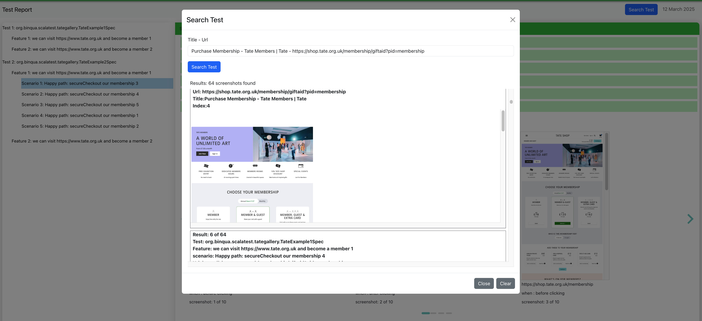
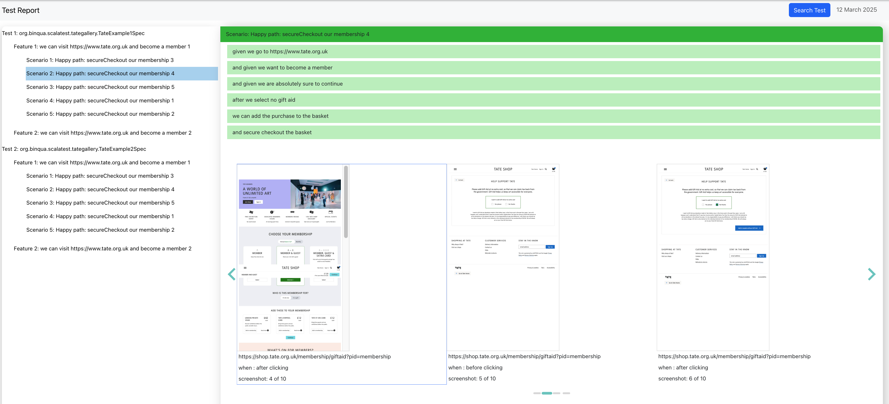

## Table of Contents

- [Motivation](#motivation)
- [Project Overview](#project-overview)
- [Features](#features)
- [Installation](#installation)
- [Example Outputs](#example-outputs)

## Motivation

Throughout my career, I’ve worked on complex web applications — particularly in the public sector — where services often involve numerous, branching workflows. In these environments, users must navigate through many screens, forms, and decision points to complete a process. This complexity naturally extends to the development side, especially when writing acceptance tests using tools like Selenium.

One recurring challenge I’ve observed is knowledge loss and difficulty navigating legacy test logic. I’ve always said that, like applications, knowledge must be scalable — and if it lives only inside someone’s head, it isn’t. One of the most frustrating (and oddly common) situations is when documentation exists on Confluence but hasn’t been updated in ages. It becomes unreliable — especially for new team members trying to understand how the application works.

I remember situations like:

*“Hey, do you remember that checkbox for enabling Feature A? I think it’s under some eligibility condition...”
“Hmm, that was added ages ago... I don’t really remember. You’ll have to dig through the tests or try it manually.”*

Worse still, when a key developer leaves, entire areas of functionality — particularly edge cases or rarely used paths — become unclear or forgotten. Developers are left chasing scattered clues in test files, or manually clicking through the UI, just to figure out where a feature is used or how it behaves.

In an ideal world, acceptance test reports would serve as living documentation — searchable, navigable, and rich in visual context. I want to build a tool that brings us closer to that: a reporting layer that not only captures screenshots during test execution, but also allows developers and testers to search by keyword, component, or scenario to instantly find where a feature is covered.

I also see this tool benefiting stakeholders, providing visual confirmation that the application is behaving as expected — making test results easier to understand, trust, and communicate.

Yes, you can search the code — but just like we use IDEs to streamline understanding and navigation, I want to bring that same power to acceptance tests.

## Project Overview

The goal of this project is to build a custom [Scalatest](https://www.scalatest.org) [Reporter](https://www.scalatest.org/scaladoc/3.0.5/org/scalatest/Reporter.html)

that captures all screenshots taken during automated tests of a web application.
To enable this, the reporter should be used alongside [FeatureSpecs](https://www.scalatest.org/user_guide/selecting_a_style) powered by [WebBrowser](https://www.scalatest.org/scaladoc/plus-selenium-2.45/3.1.1.0/org/scalatestplus/selenium/WebBrowser.html).
This setup allows the final test report to serve not just as a validation artifact, but also as living documentation of the entire application.

Now, imagine extending this concept further: in addition to screenshots, the reporter could also collect the HTML source code of each page rendered during testing.
By indexing this source code, users could search and explore the test reports to discover where specific concept (e.g., feature X, component Y, or behavior Z) appears throughout the app. This would make the test report an invaluable knowledge base for all stakeholders — including business analysts, testers, developers, and even new team members.

You wouldn’t need deep familiarity with the app — the test report itself would explain how the application behaves, assuming tests are written to cover key functionality as they should be.

## Example Outputs

Below there is an example of part of json generated by the report, with all the details of the executed tests:

Below is an example of the generated report (WIP):

Below is an example of a possible way to query for test (WIP).

Below is an example of query result (WIP). 

## Features

coming

## Installation

coming
