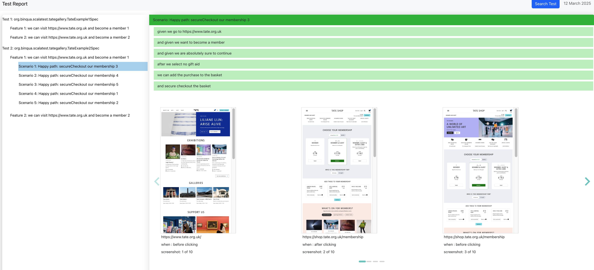

## Table of Contents

- [Project Overview](#project-overview)
- [Features](#features)
- [Installation](#installation)

## Project Overview

The purpose of this project is to create a [Scalatest](https://www.scalatest.org) custom 
[Reporter](https://www.scalatest.org/scaladoc/3.0.5/org/scalatest/Reporter.html) 
able to collect 'all' the screenshots of the web app exercised during the test.
To achieve that, the reporter has to be used in combination with a [FeatureSpecs](https://www.scalatest.org/user_guide/selecting_a_style) 
backed by a [WebBrowser](https://www.scalatest.org/scaladoc/plus-selenium-2.45/3.1.1.0/org/scalatestplus/selenium/WebBrowser.html).
In this way the final tests report could be used as effective documentation of the entire application.
Could you imagine if you could also collect the source code of the html pages generated and indexing these sources and
providing to the user a way query this generated index to search, and explore the report to find out in which test/spec 
the concept X, Y and Z are is used in the app?
The report will become an invaluable source of knowledge for stakeholders, BAS, testers and devs. You do not have to 
know the app because the test report will tell you how the app will work, if you previously wrote a test that covers this 
or that functionality as you should do.

Here is an example of the report generated (Under construction - with the missing search capability):

 

## Features
coming

## Installation

coming
